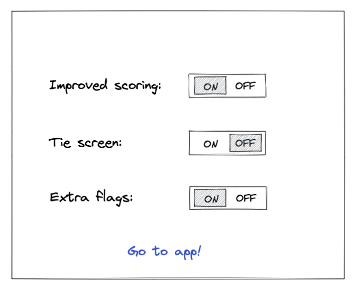

# 4 - Improved Feature Flagging
The feature flagging feature you build worked pretty well but our account manager was complaining about opening dev tools to turn features on and off when making demos for clients. She wants a basic page where all feature flags are shown so anybody without programming skills can decide what features to turn on or off and she did a quick sketch:

## Create a setup page
Management is curious if such a setup page would be beneficial to have when working with continious delivery and so you are tasked to build a simple page reacheble from `your-url.com/setup`. That page should be a simple UI similar to our account manager Stella's sketch but keep it simple it's only for internal usage. Toggling feature flags on or off in that UI should then set the values in `localStorage`. There should also be a link to take you to the first page of the app to try out your newly set feature flags.

Don't forget to [put a green checkmark](README.md) before you continue to the next task!

[Continue!](5-randomized-order.md)
