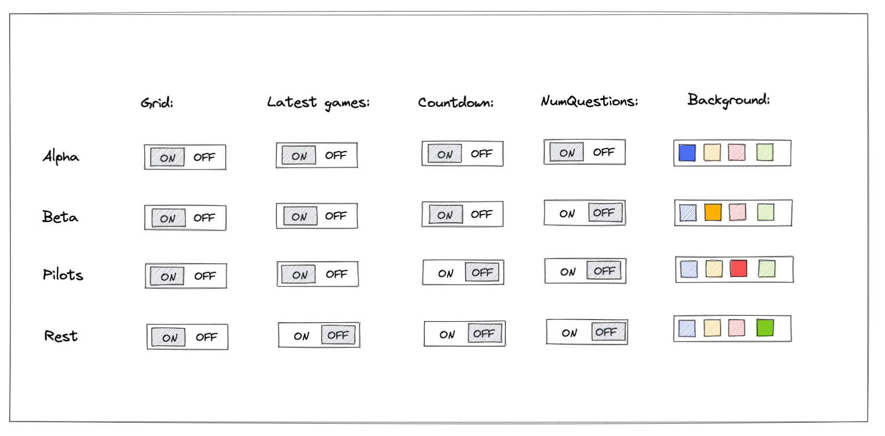
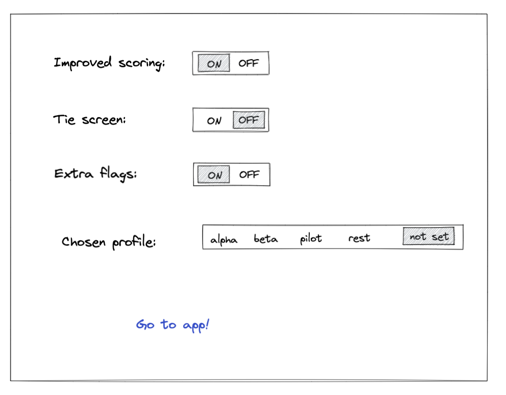

# 7 - Advanced Feature Flags
Gwen, then Sales Director of Initech have been watching your progress and is very impressed by this modern way of working. However she had an epiphany last night while trying to fall asleep, "what if we used the real time database for feature flags too?". Her goal was to be able to flip feature flags for customers and have them see the change directly in their browser without having to refresh. The rest of the management team thought it was worth a try but also wanted to elaborate more with alpha and beta releases as well as trying out the ability to roll out new versions gradually to the userbase.

## Feature flags using Firebase
Keep your exising feature flags for previous tasks using local storage. But also add a second feature flagging system based on firebase. That is, your feature flags should reside in firebase.

The difference is now we want to bundle feature flags into different "profiles". We want to have an "alpha" and a "beta" profile that can be congifured to have different feature flags flipped on or off. We also want to be able to gradually roll out new features to our user base instead. Therefore we also want two profiles called "pilots" and "rest" where the idea is to ranomly have 30% or users be "pilots" and get to try some new features before the "rest" 70%. By doing this we can run some usabilitiy studies on the "pilot" group and see if new features seems appriciated before pushing them out to all our users.

## Advanced view

Your task is to implement a second setup page at `your-site.com/setup-advanced` that should look somewhat like the sketch above. As you can see, the profiles Alpha, Beta, Pilot, Rest should be configurable separatly by flipping different feature flags on or off. In order to keep track of what profile a visitor is using we also want to be able to set a different background for each profile. This should change the background at the bottom of the app which is for the moment blue. This `setup-advanced` page should be connected to firebase under a new key, for instance `featureFlags`. That is - don't put your feature flags

## Using the advanced flags
You will in the upcoming task use the advanced feature flags you just created. In order for testing to be easier, your team is also asked to update the `/setup` page to include a new "Chosen profile" section where we can set if we are a alpha, beta, pilot or rest user. The selected option should be stored in localStorage under the key "profile". If no value is set for "profile" in localStorage, the UI should mark the "not set" option like in the sketch below. Also, if you have chosen alpha and change to "not set" the localStorage key "profile" should be removed completely.

On app startup (eg. in `index.js`) you need to check for the localStorage key "profile" and if it is not set, it should be set to "pilot" by a 30% chance and to "rest" by a 70% chance. This is a simple way of segmenting our user base into "pilot" and "rest".

---

When your `/setup-advanced`, `/setup` and `index.js` 30% / 70% selection seems to work, continue to the next task to test our your new fancy feature toggles.

Don't forget to [put a green checkmark](0-instructions.md) before you continue to the next task!

[Continue!](8-new-features-and-ab-testing.md)

