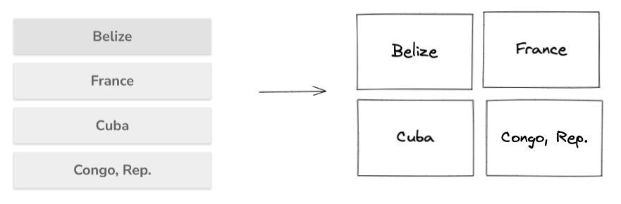
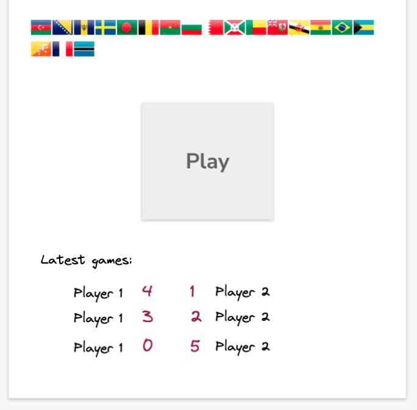

# 8 - New features and A/B-testing
With your super-fancy feature toggles you are now tasked to create a couple of new features using trunk based development and your new toggles.

## Background
First let's implement the background feature. A feature toggle doesn't have to be a boolean value, it can be a number or a string or whatever you like really. So in `App.js` read your feature toggles from firebase from the profile set in localStorage under the `profile` key. Use the background toggle to set the background to blue, yellow, red or green based on the value set in firebase from the `/setup-advanced` page.

Make sure to test all 4 profiles by setting them in `/setup` and going to the app and check that the background in the bottom of the app updates correctly.

Since this new feature system is based on Firebase real-time database, also try to open up a new tab in Chrome and open the `/setup-advanced`page and change the background color on the alpha profile. While at the same time in another chrome tab you are running the app using the alpha profile. The background color should update for the alpha profile without having to press refresh in the browser! Pretty dynamic, right :)

## Setup LogRocket
We are going to do some A/B testing in this task so start by setting up LogRocket and adding it to your app and make sure it works.

---
The following 4 features could be done in parallel if your team wishes to divide responsability. Make sure to only work against the main branch and use 4 different feature flags, one for each new feature.

## Grid
Our head UX-designer wanted to try to arrange the possible alternatives for questions in a different way. He attached a sketch below:

Your task is to implement this new feature and hide it behind a new advanced feature flag. Note that you should not change any of the game logic, only the arrangement of the answers. It should be possible for two players of different profiles to play with each other while one uses the grid view and the other the old view. For example if you have enabled the grid view for the alpha profile, the alpha players will see the grid while playing, even if they play with a beta user for which you might have turned of the grid flag. The beta user will see the old view but the two should still be able to play with each other.

#### User tests
Your UX-designer isn't really sure if the Grid-view will be better than the stacked one so he want us to both run some quantitative and some qualitative UX-testing to help us decide which view should be default.

**Quantitative feedback:** Using [`performance.now()`](https://developer.mozilla.org/en-US/docs/Web/API/Performance/now) implement a small feature that tracks how long time it takes for a player to answer the question. Send an event to Goolge Analytics that you set up before where you track the time it took for the player to answer and if (s)he used the grid view or the stacked view. Eg. event could be ['answer-time-grid', 1.12 seconds] or ['answer-time-stacked', 2.3 seconds]. Our UX-designer wants to later be able to see if players using the grid view are faster or slower on average in clicking the answers.

**Qualitative feedback:** Let a couple of users use a profile that has gird view enabled and some that have it disabled. Go to your LogRocket account and replay a couple of sessions and see if you get any insights from watching how users interact with the stacked vs. the grid view.

## Latest games
The client have requested that there should be a short list of the 3 or 4 latest games played and their scores. They have attached a simple sketch:

Make sure to do development behind an advanced feature flag and practice trunk based development as usual.

**Tip!** You might need to add a `finishedTime` field or similar to each `game` object in Firebase when a game is finished so that you can filter out the latest games on the start page.

## Countdown
The CEO of Initech is quite an impatient person and she doesn't like the wait between questions. She suggests that your team implements a countdown along the lines of "Next question in 3...2...1" that is shown between questions after a player has answered.

Make sure to do development behind an advanced feature flag and practice trunk based development as usual.

**Tip!** Make sure that the countdown is "synced" between player1 and player2 so that they don't get different coundowns.

## Number of questions
The flag game is now taking of internaly in Initech and people are playing during their lunch breaks like crazy. But many beta-testers say the game is too short. They want more than 5 quetions!

Implement a new feature that makes the players able to chose the number of questions that should be generated when they start a new game.

Make sure to do development behind an advanced feature flag and practice trunk based development as usual.

**Tip!** If you look in the `StartPage` component in `App.js` you'll see that the `utils.createGame` function is called when player2 (the second person) clicks "Play". So one easy way of implementing it might be to replace the "Play" button with tree buttons "Play 5", "Play 10" and "Play 15" when the key `nextGame` in Firebase is not null.

---
🤘🤘🤘🤘🤘🤘🤘🤘🤘🤘🤘🤘🤘🤘🤘🤘🤘🤘🤘🤘🤘🤘🤘🤘🤘🤘🤘🤘🤘🤘🤘🤘🤘🤘🤘🤘🤘🤘🤘🤘🤘🤘🤘🤘🤘🤘

If your team has reached here, you should probably be quite proud of yourselves. Our CEO Mr. Lumbergh thanks you for all your hard efforts and hints that you probably have a sizable christmas bonus comming your way this year.

[Continue to the last task to achive pass with distinction!](9-suggest-improvements.md)
